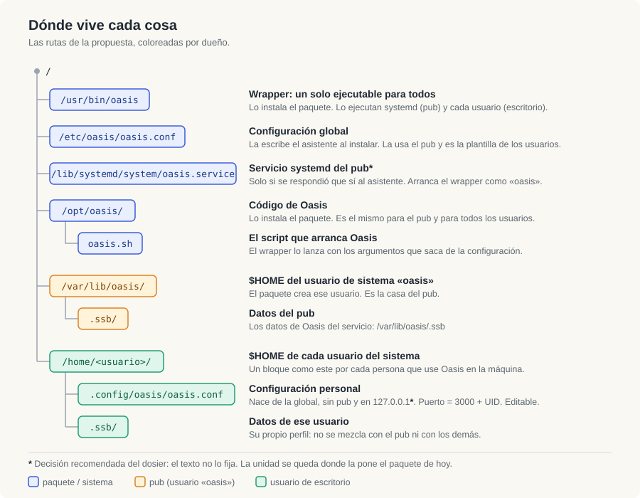
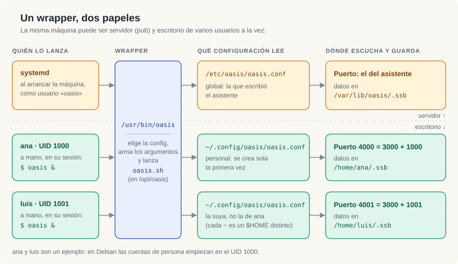
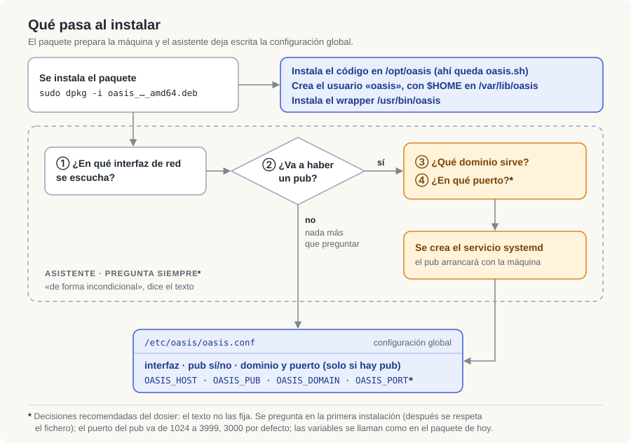
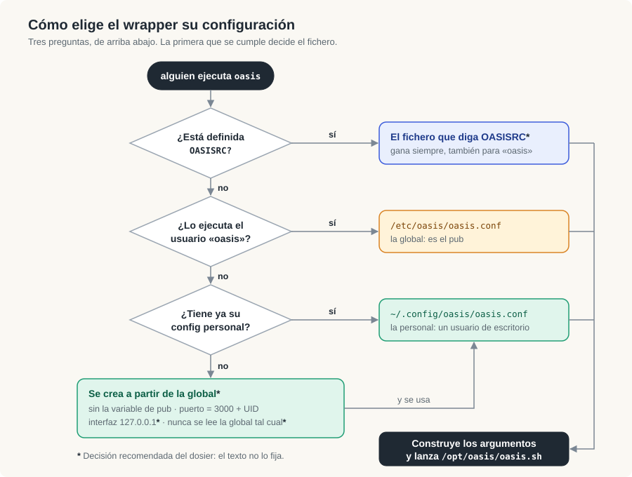
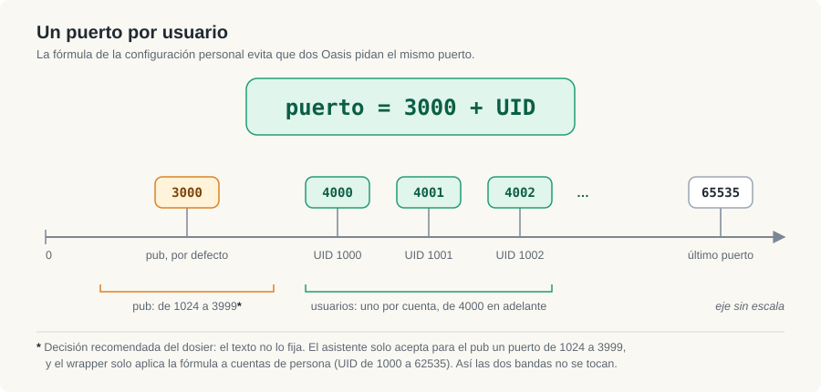

# Dosier visual · propuesta de estandarización de ubicaciones · 2026-10-06

Ayuda de lectura para el texto **«Propuesta de estandarización de ubicación de archivos en una
instalación de Oasis en un paquete deb»**, en su **versión corregida**:
[`PROPUESTA-v2.txt`](PROPUESTA-v2.txt)
(sha256 `7437362bbf3a88560c9a7e394867d6d824007ab3d97c1130b895f495644b3c0a`). Las citas `L7`, `L11`…
son sus números de línea. La primera versión, sobre la que se hizo el primer dosier, queda en
[`PROPUESTA-v1.txt`](PROPUESTA-v1.txt).

Cinco esquemas, uno por idea. En todos, el color dice de quién es cada cosa:

| Color | Dueño |
|---|---|
| azul | el paquete y el sistema |
| ámbar | el pub (usuario de sistema `oasis`) |
| verde | cada usuario de escritorio |
| `*` | **decisión recomendada del dosier**: no viene en el texto; vale hasta que quien firma diga otra cosa |

Lo que va en azul, ámbar y verde sale del texto. Lo que lleva asterisco y las secciones 7 y 8 son
del dosier: ahí cruzamos la propuesta con el paquete que hoy construye el kit (`packaging/`) y con
el código de la aplicación, citando el fichero.

## La propuesta en una frase

Un solo `.deb` deja la máquina lista para ser **pub** y **escritorio de varios usuarios** a la vez:
un wrapper único (`/usr/bin/oasis`) que, según quién lo ejecute, lee la configuración global o la
personal, y con eso lanza `/opt/oasis/oasis.sh`.

## Qué cambia de la v1 a la v2

| Cambio en el texto | Dónde | Qué resuelve |
|---|---|---|
| Párrafo nuevo: el código se instala en `/opt/oasis` y `oasis.sh` vive ahí | `L5` | Era una de las dos cosas «sin ubicar» del esquema 1, y parte de una pregunta abierta. |
| El final ya está completo: «…que necesita el script `/opt/oasis/oasis.sh` para lanzar oasis.» | `L15` | Cierra la pregunta de si el texto estaba cortado. |
| «Interfaz **de red**», y el asistente pregunta en dos pasos: primero la interfaz, «a continuación» si habrá pub | `L7` | Precisa el orden; el esquema 3 ya lo dibujaba así. |
| «…respondido afirmativamente **al asistente**» | `L10` | Precisa quién decide que se cree el servicio. |

Lo demás no cambia: mismas rutas de configuración y datos, misma fórmula de puerto y mismo párrafo
sobre cómo elige el wrapper su fichero. Las otras nueve preguntas del primer dosier se cierran en la
sección 8 con una decisión recomendada, marcada con asterisco.

## 1. Dónde vive cada cosa

Seis rutas del texto (`L5`, `L7`, `L9`, `L11`, `L13`) y una decidida (la unidad de systemd). El
código se queda en `/opt/oasis`; la configuración sale de `$HOME` del servicio y pasa a `/etc`; los
datos se quedan donde están; cada usuario gana un fichero propio en `~/.config`.

## 2. Un wrapper, dos papeles

El pub y los usuarios comparten el ejecutable y el código; lo que es de cada uno es su
configuración, su puerto y su `.ssb` (`L10`, `L11`, `L13`).

## 3. Qué pasa al instalar

El asistente pregunta siempre la interfaz de red y, a continuación, si habrá pub; dominio y puerto
solo si lo hay. El servicio de systemd se crea solo en ese caso (`L7`, `L10`). Los tres asteriscos
son las decisiones 4, 3 y 9 de la sección 8.

## 4. Cómo elige el wrapper su configuración

Es el párrafo más denso del texto (`L15`), y el esquema lo ordena así: primero `OASISRC`, luego
quién ejecuta, luego si existe el fichero personal. Ese orden es **nuestra lectura**; donde el texto
admitía otra, el esquema asienta la recomendada y la marca con asterisco (decisiones 1, 2 y 5 de la
sección 8). La v2 no toca este punto.

## 5. Un puerto por usuario

La fórmula vive en el fichero personal, así que cada usuario puede cambiarla y volver a lanzar
(`L11`). Los UID del dibujo son un ejemplo. Las dos bandas, pub por debajo de 4000 y usuarios de
4000 en adelante, son la decisión 3 de la sección 8.

## 6. Lo que la v2 deja cerrado

- **El texto está completo.** Termina en «…para lanzar oasis.» (`L15`).
- **`oasis.sh` vive en `/opt/oasis`** (`L5`, `L15`), donde ya lo pone el paquete de hoy.

## 7. De hoy a la propuesta

«Hoy» es el paquete regenerado del kit, `oasis_1.2.2-1`, tal como lo construye
[`packaging/build-deb2.sh`](../../packaging/build-deb2.sh).

| | Hoy (kit, `1.2.2-1`) | Propuesta |
|---|---|---|
| Código y `oasis.sh` | `/opt/oasis` | `/opt/oasis` (igual) |
| Configuración del servicio | `/var/lib/oasis/.oasisrc`, modo 600, de `oasis` | `/etc/oasis/oasis.conf` |
| Configuración por usuario | no existe | `~/.config/oasis/oasis.conf`, se crea sola |
| Quién lee la configuración | `/opt/oasis/oasis-run`; solo lo llama systemd | `/usr/bin/oasis`; lo llaman systemd y los usuarios |
| `/usr/bin/oasis` | lanzador: `cd /opt/oasis` y `oasis.sh "$@"`, sin leer configuración | wrapper: elige configuración, arma argumentos, lanza `oasis.sh` |
| Asistente | pregunta pub y dominio; solo en la primera instalación; sin terminal lee el entorno | pregunta siempre: interfaz de red, pub y, si hay pub, dominio y puerto |
| Interfaz | la decide el `postinst`: `127.0.0.1` cliente, `0.0.0.0` pub | la pregunta el asistente |
| Puerto web | `OASIS_PORT="3000"` fijo en `.oasisrc` | pub: el del asistente · usuario: 3000 + UID |
| Elegir otro fichero | `OASIS_HOME` cambia la carpeta donde se busca `.oasisrc` | `OASISRC` apunta al fichero |
| Datos | `/var/lib/oasis/.ssb` (la unidad fija `HOME=/var/lib/oasis`) | igual para el pub; cada usuario en su `~/.ssb` |

## 8. Decisiones recomendadas `*`

Las nueve preguntas que quedaban abiertas, cerradas con la opción que recomendamos. El asterisco
significa lo mismo en todo el dosier: **lo decide el dosier, no el texto**. Cada decisión lleva su
porqué y lo que la haría cambiar. Entre paréntesis, el número que tenía la pregunta en el primer
dosier.

**Del propio texto**

1. **`OASISRC` gana siempre, también para `oasis`** (antes 2). Una sola regla: lo explícito manda
   sobre lo implícito. La unidad de systemd no define la variable, así que el pub sigue leyendo la
   global. *Asterisco:* `L15` presenta primero el caso de `oasis` y después la variable, sin decir
   cuál gana; esta es nuestra lectura.
2. **El fichero personal se crea; nunca se lee la global tal cual** (antes 3). Si no puede crearse,
   el wrapper se detiene con un aviso. Por qué: `L11` lo dice expresamente, y la fórmula del puerto
   vive en ese fichero; lanzar a un usuario con la global tal cual lo lanzaría con la variable de
   pub y con el puerto del pub, justo lo que la fórmula evita. *Asterisco:* el «y si no, el fichero
   global» de `L15` lo leemos como «la global es la plantilla», no como «se usa la global».
3. **Dos bandas de puertos que no se tocan** (antes 4). El asistente solo acepta para el pub un
   puerto de 1024 a 3999, y propone 3000, que es lo que hoy fija el paquete (`OASIS_PORT="3000"`).
   El wrapper solo aplica la fórmula a cuentas de persona, UID de 1000 a 62535; con root, una cuenta
   de sistema o un UID que diera un puerto por encima de 65535, se detiene con un aviso (esa cuenta
   puede seguir usando `OASISRC`). *Asterisco:* que las cuentas de persona empiecen en 1000 es la
   convención de Debian (`UID_MIN`); y quien edite su fichero puede salirse de su banda, `L11` se lo
   permite.

**Al cruzarlo con el paquete de hoy y con la aplicación**

4. **«Incondicional» quiere decir «sea pub o no», no «en cada instalación»** (antes 5). El asistente
   pregunta en la primera instalación si hay terminal; sin terminal toma las respuestas del entorno
   (`OASIS_PUB`, `OASIS_DOMAIN`, y por la misma vía interfaz y puerto) o los valores por defecto,
   cliente en `127.0.0.1`; en una actualización respeta `/etc/oasis/oasis.conf`. Por qué: es lo que
   ya hace el paquete de hoy (hallazgo F6, [`packaging/README.md`](../../packaging/README.md)),
   cubierto por los casos T5 y T6 del banco, y una instalación desatendida no puede quedarse
   esperando una respuesta. *Asterisco:* contradice la lectura literal de `L7`.
5. **El fichero personal nace siempre en `127.0.0.1`, diga lo que diga la global** (antes 6). Por
   qué: la interfaz web no tiene autenticación (fila «seguridad» de `packaging/README.md`); si el pub
   escucha en `0.0.0.0`, heredar esa interfaz abriría el perfil del usuario a la red. Quien quiera
   abrirlo lo edita. *Asterisco:* `L11` solo dice que se quita la variable de pub; esto también
   sustituye la interfaz.
6. **Puerto de SSB: el pub en 8008; cada usuario en `8008 + UID`, la misma fórmula que el puerto
   web** (antes 7). El wrapper lo deja en un fichero de la carpeta personal y se lo pasa a la
   aplicación con `OASIS_SERVER_CONFIG_OVERRIDE`, que se fusiona por encima de
   `src/configs/server-config.json`
   ([`src/server/ssb_config.js`](../../../../../src/server/ssb_config.js), líneas 37-41). *Asterisco,
   y grande:* esa variable es un guard de este fork, no de upstream
   ([`oasis-clearweb/dosier/01-hallazgos-codigo.md`](../../../oasis-clearweb/dosier/01-hallazgos-codigo.md),
   hallazgo 4); la decisión depende de que el autor de Oasis acepte esas cinco líneas. Hasta
   entonces dos Oasis en la misma máquina piden los dos el 8008, y no hemos medido qué hace el
   segundo. Las dos fórmulas solo coinciden entre cuentas cuyos UID distan 5008.
7. **`/opt/oasis` no se abre: sigue siendo de root, y `src/configs` del usuario `oasis`** (antes
   8). Los usuarios de escritorio lo usan en solo lectura. Por qué: abrirlo dejaría a cualquier
   usuario cambiar la configuración del pub y la de los demás; y el estado por usuario ya va a
   `~/.ssb/oasis/` ([`src/configs/state-manager.js`](../../../../../src/configs/state-manager.js),
   líneas 45-54). *Asterisco:* la aplicación escribe ahí: `oasis.sh` retoca `oasis-config.json`
   en cada arranque ([`upstream/oasis.sh`](../../upstream/oasis.sh), líneas 66-73) y los ajustes
   de la interfaz lo reescriben (`src/configs/config-manager.js`, línea 123; `src/backend/backend.js`,
   líneas 13036-13040, medidos en el `src/` de este repo). Para un usuario de escritorio esos
   cambios no se guardarán hasta que la aplicación lea su configuración desde `~/.config/oasis`.
   No lo hemos probado.
8. **El icono del escritorio lanza el wrapper, no una URL fija** (antes 9). `oasis.desktop` pasa a
   `Exec=oasis`; para un usuario de escritorio el wrapper no añade `--no-open`, y la propia
   aplicación abre el navegador en su puerto. Por qué: el puerto solo lo sabe el fichero personal;
   hoy el icono abre `http://localhost:3000` (`build-deb2.sh`, línea 393), que con la fórmula sería
   el pub. *Asterisco:* si Oasis ya está en marcha, un segundo clic intentará arrancar otro en el
   mismo puerto; no lo hemos probado.
9. **Nombres, unidad y migración: lo que ya hay** (antes 10). Las variables se llaman como en el
   paquete de hoy, solo `KEY="VALUE"`: `OASIS_PUB`, `OASIS_DOMAIN`, `OASIS_HOST`, `OASIS_PORT`,
   `OASIS_NO_OPEN`, `OASIS_DEBUG`. La unidad se queda en `/lib/systemd/system/oasis.service`. Si
   al actualizar existe `/var/lib/oasis/.oasisrc` y no `/etc/oasis/oasis.conf`, el `postinst` lo
   traslada. *Asterisco:* `/etc/oasis/oasis.conf` pasa a ser legible por todos (`644`, de root),
   porque los usuarios lo necesitan como plantilla; hoy `.oasisrc` es `600` de `oasis`
   (`build-deb2.sh`, líneas 298-299). No lleva secretos, pero es un cambio que conviene decir.

## Materiales

| Fichero | Qué es |
|---|---|
| [`PROPUESTA-v2.txt`](PROPUESTA-v2.txt) | El texto corregido, sin tocar. Es el que dibuja este dosier. |
| [`PROPUESTA-v1.txt`](PROPUESTA-v1.txt) | El primer texto recibido, sin tocar (sha256 `729238ee28dd501763c430d740fa04768d1bc4858fbb5c9b5cddc8fe26c0c8f4`). |
| [`esquemas/01-mapa-de-ubicaciones.svg`](esquemas/01-mapa-de-ubicaciones.svg) | Árbol de rutas por dueño. |
| [`esquemas/02-un-wrapper-dos-papeles.svg`](esquemas/02-un-wrapper-dos-papeles.svg) | Pub y usuarios pasando por el mismo wrapper. |
| [`esquemas/03-asistente-de-instalacion.svg`](esquemas/03-asistente-de-instalacion.svg) | Qué crea el paquete y qué pregunta el asistente. |
| [`esquemas/04-como-elige-la-configuracion.svg`](esquemas/04-como-elige-la-configuracion.svg) | Árbol de decisión del wrapper. |
| [`esquemas/05-puertos.svg`](esquemas/05-puertos.svg) | La fórmula 3000 + UID y sus bordes. |

Los SVG son texto: se editan a mano y se abren en cualquier navegador.
