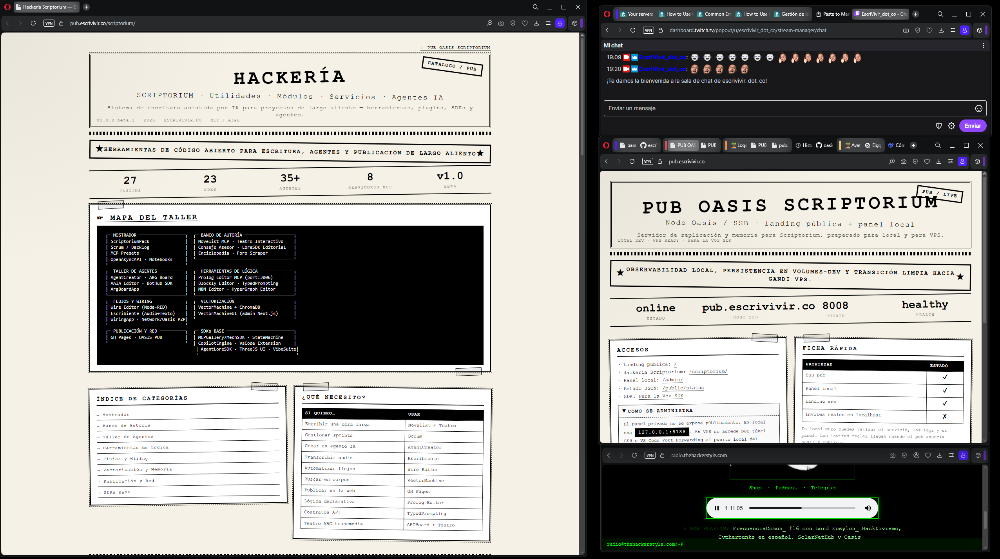

<div align="center">

# O_SDK — Oasis dockerizado



**Red social P2P sobre SSB que corres tú: cliente + pub + IA local.**
Tu nodo, tu identidad. Sin nube, sin cuentas, sin servidor central.

[](https://o-sdk.escrivivir.co)
[](https://solarnethub.com/)
[](#-quickstart)
[](https://scuttlebutt.nz)
[](#-a-quien-corresponda)
[](https://github.com/alephscriptorium-eng/O_SDK/issues)
[](LICENSE)

**🌐 Web &amp; docs: <https://o-sdk.escrivivir.co>** · **💻 Código: <https://github.com/alephscriptorium-eng/O_SDK>**

</div>

---

## 📌 A quien corresponda

> **O_SDK es un _wrapper_ Docker NO OFICIAL de [Oasis · SolarNET.HuB](https://solarnethub.com/):**
> unos ficheros para levantarlo en contenedores. Ya quedó bonito, pero todavía
> no es útil de verdad — faltan ~7 releases para que sirva pa' algo más que
> enseñarlo. Software libre, _work in progress_, sin prisa.
>
> - ❌ **NO** es un producto de [SolarNET.HuB](https://solarnethub.com) ni de [OASIS](https://github.com/epsylon/oasis).
> - ❌ **NO** está completo ni probado exhaustivamente.
> - ⚠️ Úsalo bajo tu propio riesgo.

---

## 🏠 Qué es

**Oasis** es una red social **libre, cifrada, peer-to-peer, distribuida y
federada** sobre [SSB (Secure Scuttlebutt)](https://scuttlebutt.nz). O_SDK la
empaqueta en Docker para que la levantes en un comando.

- 🔑 **Identidad soberana** — par de claves Ed25519; sin usuario ni contraseña,
  sin servidores centrales. Tu `secret` nunca sale de tu volumen.
- 📡 **Malla P2P** — funciona offline y sincroniza cuando hay red; si pierdes el
  nodo, tu feed se re-replica desde el pub.
- 🐳 **Misma imagen, dos modos** — cliente web personal (`:3000`) o **pub** de
  federación en un VPS.
- 🤖 **IA local opcional** — modelo `42` (`gguf`) servido en el propio nodo
  (GPU si hay), sin enviar nada a terceros.
- 🛡️ **Fork endurecido** — _guards_ para que el auto-update destructivo del
  upstream no corra dentro de Docker; overrides de config por entorno.

---

## 🚀 Quickstart

```bash
git clone https://github.com/alephscriptorium-eng/O_SDK.git
cd O_SDK
docker compose up -d oasis-dev      # cliente + SSB + IA
# GUI en http://localhost:3000
```

**Requisitos:** Docker 24+, 8 GB RAM. GPU NVIDIA opcional (para la IA local).

Para desplegar un **pub** de federación en un VPS:

```bash
bash OASIS_PUB/scripts/deploy.sh
```

---

## 📚 Documentación

Todo el portal FOSS vive en **<https://o-sdk.escrivivir.co>**. Manuales
operativos, reutilizables y verificados en producción:

| Documento | Descripción |
|-----------|-------------|
| [Portal (web)](https://o-sdk.escrivivir.co) | Portada + Proyecto/DevOps |
| [Protocolo de upgrade](docs/PUB/UPGRADE-PROTOCOL.md) | Subir el fork a una versión upstream sin perder identidad ni _guards_ |
| [Protocolo de recuperación](docs/PUB/RECOVERY-PROTOCOL.md) | Recuperar repo, imagen e identidad SSB tras un fallo de disco |
| [GPU_SIMPLE.md](GPU_SIMPLE.md) | Configuración de GPU para la IA local |
| [CHANGELOG.md](CHANGELOG.md) | Historial de cambios |

---

## 🧩 Módulos

Agenda · IA (`42`) · Audios · Banking (ECOin + RBU) · Bookmarks · Calendars ·
Chats cifrados · Cipher · Courts · Documents · Events · Feed · Forums ·
Games · Governance · Images · Invites · Jobs · Legacy (gestión del `secret`) ·
Maps offline · Market · Multiverse (federación) · Opinions · Pads
colaborativos · Parliament · Pixelia · Projects · Reports · Shops · Tags ·
Tasks · Torrents · Transfers (smart-contracts) · Tribes · Videos · Wallet.

---

## 🔧 Operación

**RESTART** (`docker compose restart`) — cambios en código (`.js`/`.mjs`), env
o configuración.
**BUILD** (`docker compose build`) — cambios en el `Dockerfile`, dependencias, o
primera construcción.

### ⚠️ Respalda tu identidad

Tu identidad es la clave `secret`. **Cópiala fuera de la máquina:**

```bash
cp ./volumes-dev/ssb-data/secret /media/TU_USB/oasis-backup/
```

Si pierdes el nodo pero conservas el `secret`, recuperas tu feed de la red.
Sin él, no.

---

## 🙌 Créditos (upstream)

Este repo **dockeriza** el trabajo de otros. El mérito del proyecto es suyo:

- 🏠 **OASIS / SolarNET.HuB** — <https://solarnethub.com> · wiki:
  <https://wiki.solarnethub.com>
- 💻 **Código fuente Oasis** — [github.com/epsylon/oasis](https://github.com/epsylon/oasis) (GNU AGPL v3)
- 🐙 **Kräkens.Lab** — <https://krakenslab.com>
- 💰 **ECOin** — <https://ecoin.03c8.net>

---

## 📜 Licencia

Los ficheros de este _wrapper_ se publican bajo la
**[Animus Iocandi Public License (AIPL) v1.0](LICENSE)** — _"intención de
bromear"_: se comparte con espíritu lúdico y sin garantía alguna.

El código de OASIS pertenece a sus creadores en
[SolarNET.HuB](https://solarnethub.com) bajo **GNU AGPL v3**.

> _"Si algo de aquí te sirve, genial. Si se rompe, no nos culpes."_

<details>
<summary>📋 README original de OASIS (upstream)</summary>

Oasis is a **libre, open-source, encrypted, peer-to-peer, distributed &amp;
federated** project networking application that helps you follow interesting
content and discover new ones. Completely coded in node.js + HTML5/CSS.

- SNH Website: <https://solarnethub.com>
- Kräkens.Lab: <https://krakenslab.com>
- Documentation: <https://wiki.solarnethub.com>
- Roadmap: <https://wiki.solarnethub.com/project/roadmap>
- Call 4 Hackers: <https://wiki.solarnethub.com/community/hackers>
- Public PUB "La Plaza": <https://pub.solarnethub.com/> · stats: <https://laplaza.solarnethub.com/>

</details>
