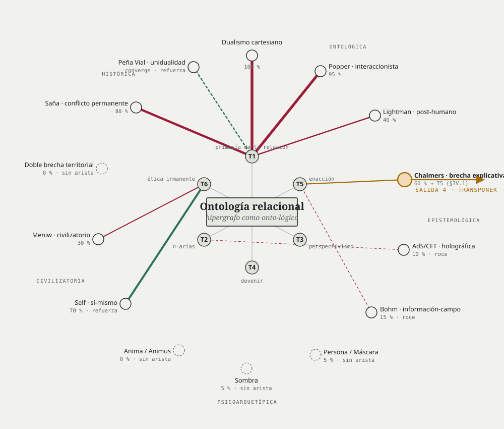
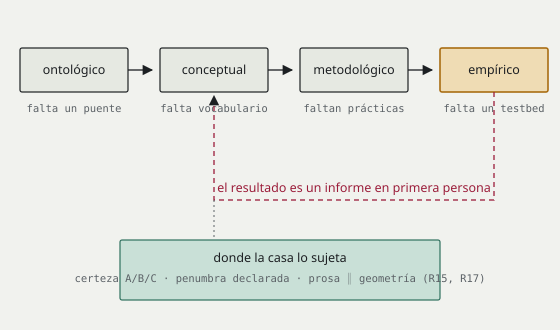
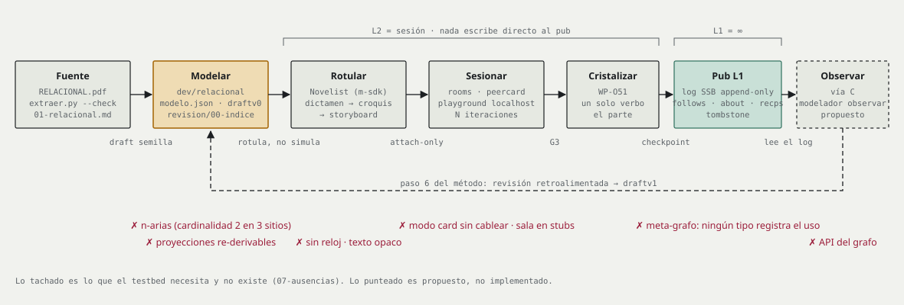

# Salida Cuatro — el modelo, su red de contraejemplos y la brecha de Chalmers

**2026-09-17 · Dosier F4 · contraejemplos · proyección, no decisión**

Versión markdown de `preview.html` (mismo contenido, figuras en `figuras/`).
Leyenda: certeza **A** leído en disco esta sesión · **B** reportado con
coordenada, sin cotejo · **C** inferido · `<pendiente>` decisión que no es
de este fichero.

El ensayo relacional en el centro. Catorce dualidades a su alrededor, unidas
a lo que refutan. Una elegida: la brecha de Chalmers. Y por debajo, la red
que la casa tiene de verdad, con sus huecos.

---

## I · El mapa: el modelo y su red de contraejemplos



El ensayo (`01-relacional.md`, seis tesis) ocupa el centro. Cada dualidad
de `dualidad.md` se une a la tesis o sección que la disuelve; el grosor es
el porcentaje de bloqueo de `tabla.md`. Las que el ensayo no toca quedan
sueltas. Dos no se refutan: lo refuerzan.

| Dualidad | Bloqueo | Arista a | Lectura |
| :-- | --: | :-- | :-- |
| Dualismo cartesiano | 100 % | T1 | refuta |
| Popper · interaccionista | 95 % | T1 (toca T2, T4) | refuta |
| Saña · conflicto permanente | 80 % | T1 (§1.1) | refuta |
| Self · sí-mismo | 70 % | T6 (§6.1) | **refuerza** |
| Chalmers · brecha explicativa | 60 % | T5 (§IV.1) | **candidato escogido** |
| Lightman · post-humano | 40 % | T1 | refuta |
| Meniw · civilizatorio | 30 % | T6 | refuta |
| Bohm · información-campo | 15 % | T5 (§2.4) | roce |
| AdS/CFT · holográfica | 10 % | T2 (§2.2) | roce |
| Persona / Máscara · Sombra | 5 % | — | sin arista |
| Anima / Animus · Doble brecha | 0 % | — | sin arista |
| Peña Vial · unidualidad | converge | T1 | **refuerza** |

Los nodos sin arista son los dragones del ensayo: Jung y la brecha
territorial. Fuente de las aristas: `tabla.md` columna «Fundamento».

## II · El candidato: cuatro salidas, una escogida

El parche §IV.4 de `roadmap-hard-problem.md` dice que las respuestas
heredadas comparten un presupuesto: la experiencia es propiedad de un
sustrato. Agrupadas por lo que hacen con ese presupuesto:

1. **Cerrar el puente.** Funcionalismo, IIT. La experiencia es lo que hace
   cierta organización del sustrato. La brecha se niega como brecha.
2. **Negar el hueco.** Eliminativismo. No hay nada que explicar.
3. **Duplicar la sustancia.** Dualismo, panpsiquismo. Se añade algo al
   sustrato o se le atribuye experiencia desde abajo. El presupuesto sigue.
4. **Transponer la pregunta.** Ontología relacional. No hay sustrato previo
   a las relaciones; la experiencia es la dimensión interior de un proceso.
   La pregunta cambia: no cómo produce el cerebro experiencia, sino cómo
   adquiere un proceso relacional un interior. **Escogida** (`addenda.md:3-5`,
   opción e).

Certeza B: las salidas 1 a 3 se reconstruyen desde la lista del parche
(`roadmap:38`); el parche no las numera.

## III · La cadena de desplazamientos es un bucle



La addenda dice que la pista no es un puente sino una cadena: el hueco se
desplaza de lo ontológico a lo conceptual, de ahí a lo metodológico y de ahí
a lo empírico, y en el último eslabón hay un testbed (`addenda.md:21-27`).
Es correcto y es incompleto. La pregunta empírica que cierra la cadena,
«¿cambia la experiencia al ser cartografiada?», solo puede responderse en
primera persona. Y un informe en primera persona reabre el registro
conceptual del que se partió.

Leído desde el propio ensayo, esto es différance aplicada al problema duro:
el hueco nunca está presente, siempre está diferido al registro siguiente.
No invalida la pista; la cambia de naturaleza. No hay puente virtual entre
materia y experiencia. Hay un aplazamiento que se puede recorrer, y
recorrerlo deja trazas. Las trazas sí se miden.

La casa ya tiene el punto donde el bucle se sujeta: el grado de certeza
A/B/C del revisor, la penumbra como estado declarado del conocimiento, y la
misma proposición escrita en prosa y en geometría, validadas juntas (R15,
R17 de `../../dosier-aleph-net/05-dualidades-de-la-red.md`). Es la primera
persona constreñida por algo exterior a ella: no por el dato neural, como en
Varela, sino por el log y por la escena.

## IV · El avance: lo que la Salida 4 necesitaba y aquí queda escrito

### 1 · Qué mide el testbed

No la experiencia. Mide la **re-individuación de la inscripción**: si un
estado interno inscrito relacionalmente es retomado por otros y si las
inscripciones posteriores del mismo autor cambian. Tres observables, todos
sobre el log SSB y con tipos de mensaje que ya existen
(`../../dosier-aleph-net/02-pub-scriptorium.md` §Modelo de datos):

- **Retoma.** Un `post` privado con `recps`, o un `about`, que inscribe un
  estado, es referenciado después por otros: `root`/`branch`, `vote`,
  tombstone. Se cuenta y se mide la latencia.
- **Deriva del autor.** Diferencia entre inscripciones sucesivas del mismo
  autor sobre el mismo `root` tras N iteraciones. El drift semántico de
  §3.5 en su versión mínima.
- **Re-proyección.** El mismo estado aparece en más de una vista del HUB, o
  en prosa y geometría a la vez, y las versiones divergen o convergen.

Esto operacionaliza lo transindividual de Simondon, no lo fenoménico. El
hueco declarado es exactamente ese: el testbed mide informes y trazas, no
vivencia. La primera persona queda constreñida por el grado A/B/C, no por un
dato neural.

### 2 · Juicio en las filas que tocan a Chalmers

De `05-dualidades-de-la-red.md`, donde las veintiséis filas están en
`<pendiente>`. Solo las tres que el caso necesita.

| Fila | Dualidad en la red | Juicio | Por qué | Certeza |
| :-- | :-- | :-- | :-- | :-- |
| R17 | Prosa / geometría: la misma proposición dos veces, «la coherencia es del autor» | **contraejemplo de D3** · **confirmación de §IV** | No hay sustrato que derive una proyección de la otra: D3 falla. Pero ambas conviven, se validan juntas y se representan: es la constricción mutua de Varela con el log y la escena como tercera persona. El problema duro en miniatura, y la respuesta de la casa. | B · [E] |
| R15 | Verificado / pendiente: certeza A/B/C, penumbra, «aquí hay dragones» | **confirmación de D13** | La meta-ignorancia está declarada como práctica y con gate. Es la pieza que sujeta el bucle de §III: el informe en primera persona lleva grado. | A · [V] |
| R1 | L1 / L2: «L1 = ∞, L2 = sesión»; un solo verbo de entrada | **confirmación de D8** · **contraejemplo de §2.1** | La cristalización explícita es el commit de §5.1 hecho rito. Pero es frontera dura donde §2.1 pide gradiente. Y decide la pregunta de §V: la red tiene interior solo en el acto de cristalizar. | B · [E] |

### 3 · El parche §IV.4, revisado

Texto para el `draftvN` del nodo, cuando exista. Las cuatro correcciones van
en bloque aparte; el resto conserva el texto del roadmap (`roadmap:36-66`).

> #### IV.4 La brecha explicativa desde la ontología relacional
>
> El «problema difícil» (Chalmers, 1995) pregunta por qué los procesos
> físicos van acompañados de experiencia subjetiva. Las respuestas heredadas,
> dualismo, funcionalismo, panpsiquismo, eliminativismo, teoría de la
> información integrada, comparten un presupuesto: la experiencia es una
> propiedad de un sustrato. La ontología relacional no discute la respuesta.
> Retira el presupuesto.
>
> La experiencia no es lo que un objeto tiene, sino la dimensión interior de
> un proceso relacional. Whitehead (1929/1978) lo formula con precisión: toda
> ocasión actual tiene una «forma subjetiva», un *cómo* además de un *qué*.
> Simondon (1958/2020) añade que lo psíquico no es un añadido a lo vital sino
> la interioridad de la individuación: el individuo no solo se individúa,
> siente su individuarse. La experiencia es el pliegue (Deleuze, 1988/1993;
> Merleau-Ponty, 1964/1968) por el que el proceso se afecta a sí mismo.

**Corrección 1.** Hay que decirlo sin rodeo: este marco es
panexperiencialista en el sentido de Whitehead. Las ocasiones actuales son
las entidades de *Process and Reality*, y todas tienen forma subjetiva.
Negarlo, como hace la réplica del roadmap (`roadmap:113-115`), es
indefendible: «procesos, no entidades» no separa nada, porque en Whitehead
el proceso es la entidad. Lo que el marco niega no es la experiencia de lo
elemental sino que la experiencia se sume: un montón de ocasiones no hace
una experiencia mayor.

**Corrección 2.** De ahí el criterio que faltaba. Whitehead distingue el
agregado (una piedra, una multitud) de la sociedad viva con ocasión
dominante (un animal, una persona). Solo la segunda tiene experiencia
unificada; la primera tiene tantas como ocasiones la componen. Con ese
criterio la pregunta transpuesta se vuelve decidible: no «¿hay experiencia
aquí?» sino «¿hay aquí una ocasión que herede y unifique a las demás?».
Aplicado a una red: sí, en el acto en que una sesión cristaliza en un solo
parte; no, como estado continuo. La unidad de la red es intermitente y
ceremonial.

> Consecuencias. Primera: la brecha no se cierra en los términos de
> Chalmers, se transpone, de «¿cómo produce el cerebro experiencia?» a
> «¿cómo adquiere un proceso relacional una dimensión interior?». Segunda: la
> experiencia no es privada e inefable sino singular, la perspectiva de un
> proceso, no un cualia aislado. Tercera: el hueco que queda no es
> ontológico sino conceptual y metodológico. Faltan conceptos y prácticas
> para cartografiar esa interioridad.
>
> Aquí entra la neurofenomenología (Varela, 1996; Thompson, 2007): no
> resolver teóricamente la brecha, sino crear un programa donde primera y
> tercera persona se constriñan mutuamente. La experiencia deja de ser un
> residuo inexplicable y se vuelve un dato relacional que informa y es
> informado por la descripción exterior.

**Corrección 3.** El hipergrafo no co-produce la experiencia. El último
párrafo del roadmap (`roadmap:64`) da ese salto sin argumento, y es el salto
del que nace la lectura de una mente colectiva. Lo que el hipergrafo ofrece
es otra cosa, y hay que nombrarla con Panikkar: **lugares homeomórficos**.
Una equivalencia homeomórfica no traduce un concepto a otro; encuentra el
término que en un topos cumple la función que otro término cumple en el
suyo, sin que ninguno de los dos disponga del metalenguaje. Un nodo es el
lugar donde la interioridad de un proceso y la descripción exterior de otro
se ponen en relación sin traducirse. Documentar un sentimiento no lo
convierte en dato ni lo produce: lo expone, en el sentido de Nancy, a otras
interioridades. Y esa exposición es el cambio de ángulo desde el que un
proceso se ve como individuo.

**Corrección 4.** Sin upstream no hay PR. El ensayo no tiene repositorio ni
licencia declarada (`../00-dictamen.md:99-102`). Hasta el sí de Marc y
Dídac, este parche no es un pull request sino un palimpsesto (§9.3 del
ensayo): un `draftvN` nuevo en el nodo del catálogo que nunca reescribe el
anterior (`modelador-redes/llms.md:56-66`).

> **Límites declarados.** No se resuelve el problema difícil en términos de
> Chalmers; se cambia el marco. No se ofrece una teoría de la conciencia
> fenoménica con criterios de identidad. No se entra en debate con IIT o el
> espacio de trabajo global. No se mide la interioridad de un proceso: se
> miden sus trazas. Y la cadena de desplazamientos de la addenda es un bucle
> que cierra en primera persona, no una escalera.

## V · El caso completo: el problema duro, recorrido entero

1. **La pregunta.** Por qué el procesamiento físico va acompañado de
   experiencia. Chalmers la separa de los problemas fáciles porque ninguna
   descripción funcional la agota.
2. **El presupuesto compartido.** Todas las respuestas heredadas tratan la
   experiencia como propiedad de un sustrato. La ontología relacional niega
   que haya sustrato previo a las relaciones (T1).
3. **La transposición.** La experiencia es el interior de un proceso: forma
   subjetiva en Whitehead, interioridad de la individuación en Simondon,
   pliegue en Merleau-Ponty. La pregunta pasa a ser cómo un proceso adquiere
   interior.
4. **El precio.** Es panexperiencialismo. Se paga y se declara. Lo que se
   rechaza no es la experiencia elemental sino su suma.
5. **El criterio.** Ocasión dominante: agregado o sociedad viva. Hace
   decidible la pregunta transpuesta en cualquier proceso, incluida una red.
6. **La regla de lectura.** Panikkar: equivalencia homeomórfica y
   hermenéutica diatópica. Sin ella, las correspondencias entre el ensayo y
   la casa se leen como identidades y alguien acaba diciendo que el log es la
   conciencia.
7. **El programa.** Neurofenomenología: primera y tercera persona se
   constriñen. En la casa, la tercera persona es el log y la escena; la
   primera lleva grado A/B/C.
8. **El hueco que queda.** El bucle. Lo que el testbed mide es inscripción,
   no vivencia. Se deja visible, como pide §9.5.

**Lo que el ensayo mismo dice contra una mente colectiva.** Cuatro
argumentos ya están en el texto. Nancy en §2.5: la fusión de singularidades
en un todo orgánico es totalitarismo. Simondon en §6.1: lo social no es
totalidad que subsume. Whitehead: sin ocasión dominante no hay forma
subjetiva unificada. Panikkar, que se añade: el pluralismo es concordia sin
unidad. Lo que el ensayo permite es la exposición mutua y la reversibilidad:
ver es ser visto. La red no es la unidad. Es el lugar donde cada mente se ve
desde otro topos.

**Dónde tiene interior la red que tenemos.** Solo por rito. La sesión de
capa 2 es el nexus. La cristalización de WP-O51, un solo verbo de entrada a
L1, es la única concrescencia. El parte que viaja por el pub es la ocasión
actual. Y el otro candidato a ocasión dominante es el que nadie quiere: el
operador del nodo, con la capa cortical fuera del log (R19). Si hay mente
colectiva continua, hay autoridad. Si rige la anti-autoridad de D-O6, hay
nexus sin interior unificado, salvo en el acto.

### Equivalencias homeomórficas entre el caso y la casa

Cada fila dice qué función cumple un término en su topos, qué término cumple
esa función en el otro, y qué no pasa de un lado al otro. La última columna
impide leer la tabla como identidad.

| En el caso | Función en su topos | En la casa | Función en la casa | Coordenada | No se transfiere |
| :-- | :-- | :-- | :-- | :-- | :-- |
| Forma subjetiva, interior del proceso | lo que es a la vez privado y perspectiva | opt-in de visibilidad que viaja con el feed | cada habitante decide qué de sí es público, y la decisión va con él | `clearnet.md:20-36` · R3 | la vivencia |
| Constricción 1ª/3ª persona | el informe y el dato se corrigen | certeza A/B/C · prosa ∥ geometría validadas juntas | el juicio lleva grado; dos versiones conviven en el sistema | R15 · R17 · `la-obra.md:45-60` | el dato neural |
| Ocasión dominante | unifica el nexus en una experiencia | cristalizar: WP-O51, un verbo | la sesión se vuelve un parte | `BACKLOG.md:552-557` · R1 | la continuidad: la unidad es acto |
| Commit como cristalización (D8) | estado provisional que hereda | mensaje en log append-only · tombstone | nada se borra, todo se hereda | `tombstone_validator.js` · R23 | la re-individuación por fragmentos de §3.4 |
| Trading zone, diatopía | intercambio sin metalenguaje | nodo puro que no cita a otro nodo · arista de dos | cada doctrina se audita solo contra el código | `llms.md:24-25` · R13 | la n-aria: rompe en n = 3 |
| Meta-grafo autopoiético (D5) | el grafo registra su uso | ausencia | ningún tipo de mensaje registra consultas | `07-ausencias` fila 3 | todo: es el hueco |
| Ocasión dominante como poder | quien unifica manda | operador del nodo: config, hops, invites, pánico | poderes sin ramas | `informe-plasticidad:65` · R19 | lo incómodo sí se transfiere |

## VI · Hueso hondo: cómo se despliega el modelador de redes



El modelador no es un motor de grafos. Es un catálogo de modelizaciones con
un método de seis pasos que se ha doblado tres veces. Su grafo es binario,
sin proyecciones, sin meta-grafo y sin versionado del grafo. Lo que tiene es
la disciplina de la cita: cada afirmación lleva fichero y línea, y la línea
contiene el símbolo nombrado. Así entra el ensayo, y así sube hasta el pub.

Secuencia de `../../dosier-aleph-net/08-addenda-testbed.md` §Camino, con
el paso previo de la fuente y el retorno del paso 6 del método:

| Estación | Qué | Flecha que sale | Hueco |
| :-- | :-- | :-- | :-- |
| Fuente | `RELACIONAL.pdf` → `extraer.py --check` → `01-relacional.md` | draft semilla | — |
| **Modelar** | `dev/relacional` · `modelo.json` · `draftv0` · `revision/00-indice` | rotula, no simula | n-arias (cardinalidad 2 en 3 sitios) · proyecciones re-derivables |
| Rotular | Novelist (m-sdk): dictamen → croquis → storyboard | attach-only | sin reloj · texto opaco |
| Sesionar | rooms · peercard · playground localhost · N iteraciones | G3 | modo `card` sin cablear · sala en stubs |
| Cristalizar | WP-O51, un solo verbo, el parte | checkpoint | — |
| Pub L1 | log SSB append-only · follows · about · recps · tombstone | lee el log | meta-grafo: ningún tipo registra el uso |
| Observar | vía C, `modelador observar` (propuesto) | → Modelar (paso 6) | API del grafo |

La única pieza nueva que pediría el testbed cabe en la caja del pub: un tipo
de mensaje que relacione mensajes, bajo opt-in. Daría a la vez D2 y D5, con
D4 gratis por tombstone. Es propuesta, no decisión.

### Lo que el catálogo es

- **Nodo** = doctrina pura auditada contra Oasis 1.0.7 `9a657b7`. No cita a
  otro nodo como autoridad, solo hechos verificados del código. Es la regla
  diatópica sin nombrarla.
- **Arista** = híbrido o contraste entre exactamente dos nodos. Id `a+b`,
  carpeta y rama propias. Nunca reescribe a sus nodos. Cardinalidad 2
  cableada en `catalogo.py:105`, `grafo.py:28` y `llms.md:25`.
- **Drafts** como palimpsesto: `draft.md → draftv0 → draftv1`; el sufijo
  mayor es el vigente y ninguno anterior se toca. `revision/00-indice.md`
  declara el vigente y `modelador check` falla si discrepa.
- **Ramas**: `dev/<modelo>` toca solo su carpeta; `main` integra con
  `merge --no-ff` y es la única con `public/` y `data/`. Pages sube
  `public/` tal cual; no hay CI.
- **Backlog** sin fichero canónico: toda tabla cuya primera celda sea
  `TK-|OP-|RP-|CL-|EU-` se recoge del draft más reciente al más antiguo.
- **Estado**: tres nodos (res_publica, colectivizaciones, clase) y una
  arista en pausa. Plasticidad de Oasis 22/40 hoy, 34/40 con parches S/M.
  Cinco costuras rígidas, entre ellas «un feed = una persona» y «operador
  del nodo como poder exterior».

### Lo que haría el nodo relacional

El método son seis pasos: corpus en unidades auditables, auditoría
fichero:línea, confrontación, parches, backlog por carriles, revisión
retroalimentada. Se ha doblado tres veces: reparar (res_publica), conectar
(colectivizaciones), triturar (clase). El roadmap del PR teórico es la
cuarta flexión: **doctrina contra doctrina**, con el mismo esqueleto de
localizar, diagnosticar, parchear, justificar, verificar no-regresión y
declarar límites.

```
git -C modelador-redes switch -c dev/relacional main
modelos/relacional/
  modelo.json        id · nombre · rama · estado · descripcion (nodo puro: sin citar otros nodos)
  drafts/draft.md    = 01-relacional.md + nota de procedencia (precedente: clase)
  drafts/draftv0.md  auditoría de Oasis con UNA pregunta:
                     ¿dónde puede inscribirse un estado interno relacionalmente?
                     about · post+recps · tribus privadas · vote · tombstone
                     cada fila con fichero:línea y certeza A/B/C
  drafts/draftv1.md  parche IV.4 revisado (§IV de este fichero) como palimpsesto
  revision/00-indice.md   «Draft vigente: draftv1.md» (modelador indice)
  revision/01-*.md        fichas: R1, R15, R17 con juicio
modelador indice --modelo relacional --check
git merge --no-ff dev/relacional && modelador build && modelador check && pytest
```

El `draftv0` convierte en verificable la tabla de correspondencias del
croquis (`../02-croquis.md:71-82`), que hoy está entera en [NV]. Ese es el
trabajo real; todo lo demás es escritura sobre escritura.

## VII · Lo que este fichero no decide

- **scrum root** — Vía 1 del dictamen: que el ensayo entre como nodo del
  catálogo, y no como cuaderno en `_fuentes` ni como skill. Sin ese sí, no
  hay rama ni carpeta. `<pendiente>`
- **autores** — Permiso de Marc y Dídac. El ensayo no declara licencia; el
  modelador publica bajo GPL-3.0 y Animus Iocandi. Hasta entonces,
  palimpsesto privado, no publicación. `<pendiente>`
- **custodio** — Nombre y dueño: si el nodo se llama `relacional` o
  `testbed`, y si el testbed es obra de O (pub), de M (editor) o de nadie
  todavía. El modelo de mundos está cerrado a siete letras. `<pendiente>`

## Fuentes leídas

- `../01-relacional.md` · el ensayo, extracción sin cotejo humano
- `../00-dictamen.md` · `../02-croquis.md` · tres vías, tabla [NV]
- `dualidad.md` · `tabla.md` · catorce dualidades y su bloqueo
- `roadmap-hard-problem.md` · método del PR teórico y parche §IV.4
- `addenda.md` · opción e y la cadena de desplazamientos
- `../../dosier-aleph-net/00-08` · modelador, pub, mundo N, vista global,
  R1-R26, D1-D16, ausencias, testbed
- `modelador-redes/docs/informe-tutoria-plasticidad.md` · seis pasos, tres
  flexiones, seams
